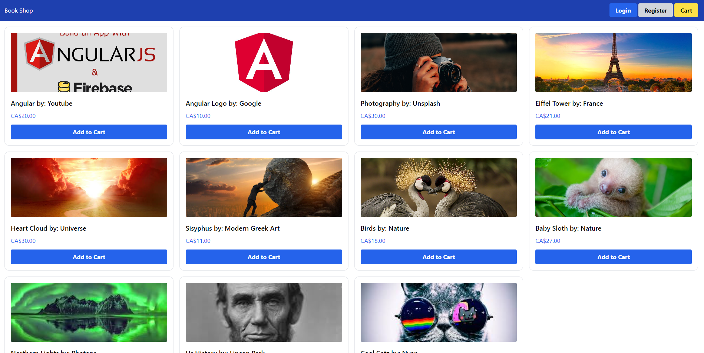
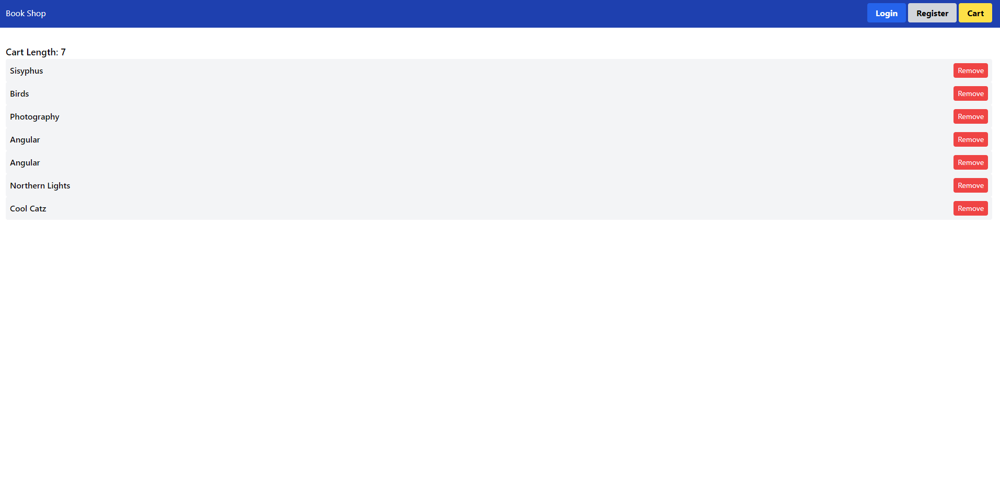
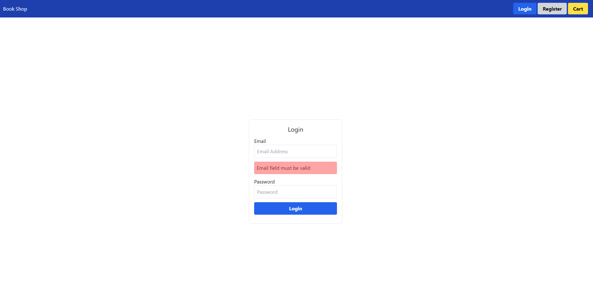
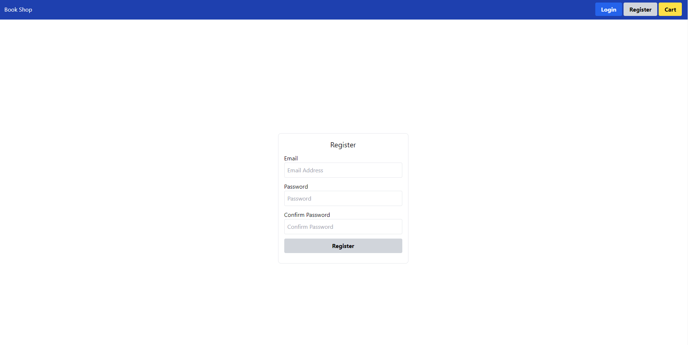

# FirebaseTestApp

Basic learning project created to learn the basics of Angular.

|  |  |  |  |
| ------------------------------ | ------------------------------ | -------------------------------- | -------------------------------------- |
| Home Page                      | Cart Page                      | Login Page                       | Register Page                          |

## Course

This project was created following this [Course](https://www.youtube.com/watch?v=IYI0em-xT28). Please look through the [Commits](https://github.com/Ibtesam-Mahmood/firebase-angular-test/commits/main) for a step by step guide to the course.

## Commands

These were the commands used within various stages of the project.

```shell
# Install Angular CLI
npm install -g @angular/cli

# Create the Application
ng new firebase-test-app

# Generate a Component
ng generate component books
ng generate component book-item
ng generate component cart

# Generate a Service
ng generate service books/books
ng generate service services/cart # Global

# Generate a Modeule (creates a folder at the name by defualt)
ng generate module books

# Install for development and create a tailwind config file
npm install -D tailwindcss postcss autoprefixer
npx tailwindcss init
```

## Styling

This project is styled using [Tailwind css](https://tailwindcss.com/docs/guides/angular)

## Additional Resources

- [Angular Set Up](https://angular.io/guide/setup-local)
- [What are Modules?](https://angular.io/guide/architecture-modules)
- [What are Components?](https://angular.io/guide/component-overview)
- [Parent/Child Binding](https://angular.io/guide/inputs-outputs)
- [Services and Dependency Injection](https://angular.io/guide/creating-injectable-service)
- [Lifecycle Hooks](https://angular.io/guide/lifecycle-hooks)
- [Angular Directives](https://angular.io/guide/built-in-directives)
- [Angular Routing](https://angular.io/guide/routing-overview)
- [Angular Pipe Docs](https://angular.io/guide/pipes)
- [Angular Forms](https://angular.io/guide/reactive-forms)
